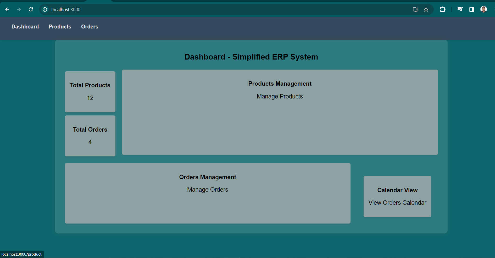

# ERP System Frontend

## Project Overview

The goal of this project is to create a simplified interface for an ERP (Enterprise Resource Planning) system, designed to efficiently manage basic business operations. The system includes the following pages:

- **Dashboard**: Provides an overview of the system's features.
- **Products Management**: Allows for the management of product listings.
- **Orders Management**: Facilitates viewing and handling orders.

Additionally, an optional feature may be implemented:

- **Orders Calendar View**: A calendar interface displaying orders based on their expected delivery dates.

## Objectives

- Develop a user-friendly interface for managing key aspects of a business.
- Utilize React for building modular components and managing application state.
- Implement navigation between different sections of the ERP system using React Router.
- Create a responsive design suitable for both desktop and mobile devices.

## Assignment Details

### Dashboard:

- Display a summary of key metrics or features (e.g., total number of products, orders).
- Include links or buttons for quick navigation to the Products and Orders management pages.

### Products Management:

- Present a list of products with details such as name, category, price, and stock quantity, using mock data.
- Enable functionalities to add, edit, and delete products.

### Orders Management:

- Show a list of orders, including details like order ID, customer name, order date, and status, using mock data.
- (Optional) Allow viewing of order details, updating the order status, and deletion of orders.

### Orders Calendar View (Optional):

- Implement a calendar view that displays orders on their expected delivery dates.
- Provide the ability to click on a date to view all orders due for delivery that day.

## Technology Stack

- **React JS**: A JavaScript library for building user interfaces.
- **JavaScript**: A programming language commonly used for web development.
- **CSS**: Cascading Style Sheets for styling the frontend components.

## Documentation

### Running the Application

1. Clone this repository to your local machine.
2. Navigate to the project directory.
3. Install dependencies by running `npm install`.
4. Start the development server with `npm start`.
5. Access the application at `http://localhost:3000`.

### Screenshots

#### Dashboard

The Dashboard provides a comprehensive overview of the system's key metrics and features. It allows users to quickly grasp the current state of their business operations, including total number of products, Total orders and Calenders.

#### Products Management

The Products Management page allows users to view, add, edit, and delete product listings. It displays detailed information about each product, such as name, category, price, and stock quantity, enabling efficient management of the product inventory.

#### Orders Management

The Orders Management section facilitates the viewing and handling of orders. Users can see detailed lists of orders, including order ID, customer name, order date, and status.
### Usage

- Upon accessing the dashboard, you'll see an overview of key metrics.
- Navigate to Products Management to add, edit, or delete products.
- View and manage orders in the Orders Management section.
- Optionally, explore the Orders Calendar View for a visual representation of order schedules.

## Contributors

- [Rajeev Kumar](https://github.com/Rajeev54321)

## Connect with Me

Feel free to connect with me on LinkedIn for more projects and professional engagements.

)

---
